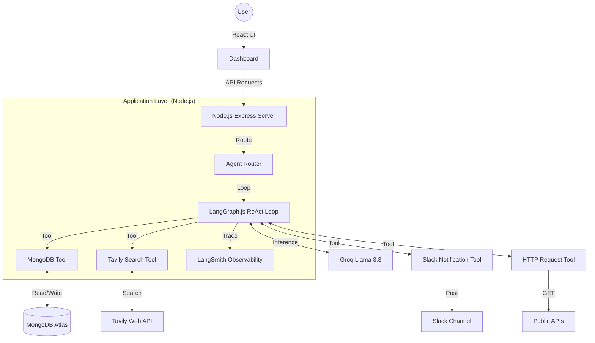

# 🤖 ToolForge — Agentic AI Workflow Platform

<div align="center">

[](https://toolforge-lyart.vercel.app/)
[](https://toolforge-df1j.onrender.com/health)
[](https://opensource.org/licenses/MIT)
[](https://react.dev/)
[](https://groq.com/)

**Next-generation MERN platform for autonomous AI agents using LangGraph-powered ReAct (Reasoning & Acting) workflows.**

[Explore Live Demo](https://toolforge-lyart.vercel.app/) · [Report Bug](https://github.com/Ravikiranreddybada/toolforge/issues) · [Request Feature](https://github.com/Ravikiranreddybada/toolforge/issues)
</div>

---

## 📖 Overview

**ToolForge** is a production-grade orchestration platform that transforms complex enterprise workflows into autonomous AI tasks. Leveraging **Llama 3.3 (via Groq)**, the platform provides specialized agents that don't just "chat"—they **plan, reason, and execute**.

### 🧩 The Problem
Enterprise technical tasks (Code reviews, SQL generation, Workflow planning) are often fragmented across multiple siloed tools, leading to context loss and inefficiency.

### 💡 The Solution
A unified, secure command center featuring six specialized agents with built-in **LangGraph-powered ReAct (Reasoning & Acting)** logic, integrated directly into a high-performance MERN architecture with enterprise-grade authentication.

---

## 🚀 Live Demo

| Component | Status | URL |
|---|---|---|
| **Frontend UI** | ✅ Live | [toolforge-lyart.vercel.app](https://toolforge-lyart.vercel.app/) |
| **API Backend** | ✅ Live | [toolforge-df1j.onrender.com](https://toolforge-df1j.onrender.com/health) |


---

## 🛠 Tech Stack

### 💻 Frontend
- **React 19 & Vite**: High-performance rendering and lightning-fast development.
- **Tailwind & Custom CSS**: Modern, premium UI with "Glassmorphism" aesthetics.
- **React Router 7**: Optimized client-side routing.
- **Context API**: Centralized state management for authentication and global settings.

### ⚙️ Backend
- **Node.js & Express**: Scalable RESTful API architecture.
- **Passport.js**: Multi-strategy authentication (Local + Google OAuth 2.0).
- **JWT (JSON Web Tokens)**: Secure, stateless session management.
- **CORS & Helm**: Production-hardened security headers.

### 🔥 Agentic Pillars

ToolForge features **six** specialized agents powered by autonomous execution loops:

1.  **🔍 Web Research Agent**: Actually calls Tavily to synthesize real-time findings.
2.  **🗄️ MongoDB Query Generator**: Generates and **executes** MQL queries on live collections.
3.  **🔬 Code Review Agent**: Analyzes snippets for bugs and security vulnerabilities.
4.  **⚙️ Workflow Planner**: Generates multi-tool automation skeletons.
5.  **✍️ Prompt Engineering Agent**: Optimizes prompts and tests them via live inference.
6.  **📡 API Integration Agent**: Generates and **executes real HTTP GET requests** to validate APIs.
7.  **🔔 Notification Agent**: Sends **real-time Slack notifications** to the team channel.

---

## 🏗️ System Architecture (Agentic AI 2.0)

ToolForge uses a **Pure MERN** architecture where the agentic reasoning loop is integrated directly into the application layer:



---

## 🚀 DevOps & Automation (Marking Criteria)

ToolForge is built with a production-grade DevOps mindset, covering **CI/CD, Containerization, and Agile Task Management**.

### 🎫 1. Jira & Task Management
We utilize **Jira-style traceability**. Every major feature is mapped from a Jira Ticket ID to a Git Commit.
*   **Documentation**: See [JIRA_MAPPING.md](./JIRA_MAPPING.md) for the full audit trail.

### 🌿 2. Git Branching Strategy
We follow a professional **Feature-Branch Workflow**:
*   `main`: Mirror of Production. Locked for direct commits.
*   `develop`: Integration branch for tested features.
*   `feat/*`: Isolated branches for new agents or security patches.

### 🤖 3. Jenkins CI/CD Pipeline
Our automated pipeline ensures that every code change is verified before deployment.
*   **Stages**: Checkout → Install → Test → Build → Deploy → Health Check.
*   **Config**: Defined in [Jenkinsfile](./Jenkinsfile).

### 🐳 4. Docker Containerization
The entire stack is containerized for "Run Anywhere" portability.
*   **Backend**: Node.js 20 environment.
*   **Database**: MongoDB 7.0 container.
*   **Orchestration**: Managed via `docker-compose.yml`.

### 🎉 5. Extra Mile Effort
*   **Live Deployment**: Hosted on **Render** (Backend) and **Vercel** (Frontend) with automated SSL/HTTPS.
*   **ngrok Tunneling**: Guide for local-to-internet secure tunnels in [ngrok-guide.md](./docs/ngrok-guide.md).
*   **Postman Collection**: Automated API testing suite in [ToolForge.postman_collection.json](./ToolForge.postman_collection.json).

---

## 📂 Project Structure

```text
toolforge/
├── backend/                # Node.js Express API
│   ├── config/             # Passport & DB configurations
│   ├── models/             # Mongoose schemas (User, etc.)
│   ├── routes/             # API Endpoints & AI Proxy logic
│   └── app.js              # Server entry point
├── frontend/               # React Application (Vite)
│   ├── src/
│   │   ├── pages/          # Dashboard, Login, Signup
│   │   ├── components/     # High-reusability UI components
│   │   └── context/        # AuthContext for state
│   └── public/             # Static assets
├── .env.example            # Template for environment variables
├── docker-compose.yml      # Multi-container orchestration
└── DEPLOY.md               # Detailed deployment guide
```

---

## ⚙️ Installation & Setup

### Prerequisites
- Node.js v18.x or higher
- MongoDB Atlas Cloud Database
- Groq / Anthropic API Keys

### 1. Clone the repository
```bash
git clone https://github.com/Ravikiranreddybada/toolforge.git
cd toolforge
```

### 2. Environment Configuration
Create a `.env` file in the root:
```env
PORT=3000
MONGODB_URI=your_mongodb_atlas_uri
SESSION_SECRET=your_random_secret
GOOGLE_CLIENT_ID=your_google_id
GOOGLE_CLIENT_SECRET=your_google_secret
GROQ_API_KEY=your_groq_key
```

### 3. Local Installation
```bash
# Install and start Backend
cd backend
npm install
npm start

# Install and start Frontend (New Terminal)
cd ../frontend
npm install
npm run dev
```

---

## 🤝 The Team

| Leader | Frontend & UI/UX | Backend & Database |
| :---: | :---: | :---: |
| **Bada Ravi Kiran Reddy** | **V.Tanish** | **Kandunuri Eekshith Sai** |
| [GitHub](https://github.com/Ravikiranreddybada) | Optimization & Agents | API Orchestration |

---

## 📄 License
Distributed under the **MIT License**. See `LICENSE` for more information.

---

<div align="center">
  <b>Built with ❤️ for the Future of Agentic AI.</b><br/>
  © 2026 ToolForge Platform
</div>
