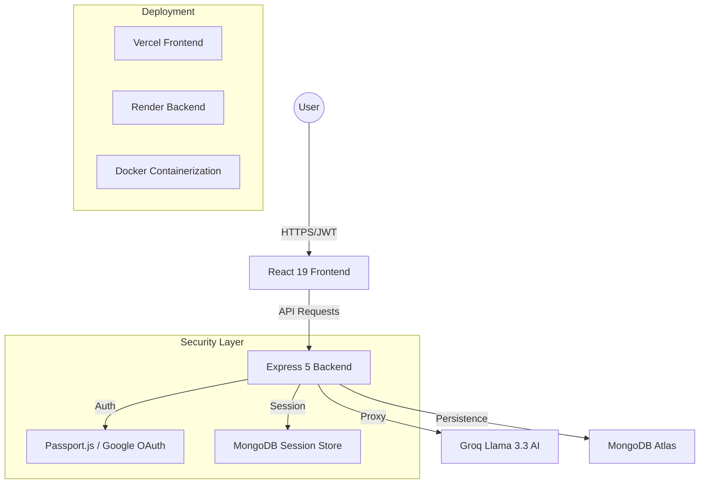

# 🤖 ToolForge — Production-Grade AI Agentic Platform

<div align="center">
  <p align="center">
    <b>A high-performance LLM-powered platform for autonomous reasoning and task execution.</b>
  </p>
  <p align="center">
    
    
    
    
  </p>
  <p align="center">
    <a href="https://toolforge-liard.vercel.app/"><strong>Live Demo</strong></a> ·
    <a href="https://toolforge.onrender.com/health"><strong>API Health</strong></a> ·
    <a href="https://github.com/Ravikiranreddybada/toolforge/issues"><strong>Report Bug</strong></a>
  </p>
</div>

---

## 📖 Overview
**ToolForge** is a production-ready MERN platform that leverages **Llama 3.3 (via Groq)** to provide four autonomous AI agents designed for enterprise workflows. Unlike standard chatbots, ToolForge agents use **Chain-of-Thought (CoT)** reasoning to plan, parse, and execute complex technical tasks.

### 🧩 The Problem
Modern workflows are fragmented. Developers and researchers spend hours switching between tools for code review, SQL generation, and market research, often losing context and precision.

### 💡 The Solution
A unified command center where specialized AI agents handle technical heavy lifting. Built with security-first architecture (JWT + OAuth 2.0) and a high-performance React frontend.

---

## 🚀 Live Demo
- **Frontend Explorer**: [ToolForge Vercel](https://toolforge-liard.vercel.app/)
- **Backend API**: [ToolForge Render](https://toolforge.onrender.com/health)
- **Demo Video**: [Loom Walkthrough (Coming Soon)](#)

---

## 🛠 Tech Stack

| Category | Technology |
|---|---|
| **Frontend** | React 19, Vite, React Router 7, Tailwind/Custom CSS |
| **Backend** | Node.js, Express 5, Passport.js (Google OAuth 2.0) |
| **Database** | MongoDB Atlas, Mongoose, Connect-Mongo |
| **AI Intelligence** | Groq API (Llama 3.3 70B), Chain-of-Thought Prompting |
| **DevOps** | Docker, Docker Compose, Jenkins, Vercel, Render |

---

## 🔥 Core AI Agents

### 1. 🔍 Web Research Agent
Autonomously researches complex topics using iterative planning.
- **Input:** Natural language query.
- **Reasoning:** Strategy Planning → Source Querying → Synthesis.
- **Output:** Structured markdown reports with key takeaways.

### 2. 🗄️ SQL Architect
Context-aware SQL generator that understands your database schema.
- **Input:** Database schema + Natural language request.
- **Reasoning:** Schema Analysis → Join Identification → Query Optimization.
- **Output:** Performance-optimized SQL query + Execution explanation.

### 3. 🔬 Code Auditor
A deep-scanning agent that reviews code for more than just syntax.
- **Input:** Code snippet (JS, Python, Go, etc.).
- **Reasoning:** Structural Parsing → Bug Scanning → Security Analysis.
- **Output:** Bug reports, security vulnerabilities, and a **Refactored Version**.

### 4. ⚙️ Workflow Automation Planner
Plans multi-tool automation pipelines for enterprise scaling.
- **Input:** Automation goal + Available tools (Slack, Gmail, etc.).
- **Reasoning:** Goal Decomposition → Tool Mapping → Skeleton Generation.
- **Output:** Step-by-step plan + **LangChain/Python boilerplate**.

---

## 📐 System Architecture



---

## ⚙️ Installation & Setup

### Prerequisites
- Node.js v18+
- MongoDB Atlas Account
- Groq/Anthropic API Key

### 1. Clone the repository
```bash
git clone https://github.com/Ravikiranreddybada/toolforge.git
cd toolforge
```

### 2. Backend Setup
```bash
cd backend
cp .env.example .env
npm install
npm start # Runs on http://localhost:3000
```

### 3. Frontend Setup
```bash
cd ../frontend
cp .env.example .env
npm install
npm run dev # Runs on http://localhost:5173
```

### 4. Docker (One-Click Setup)
```bash
docker-compose up -d --build
```

---

## 📂 Project Structure

```text
toolforge/
├── backend/                # Express API
│   ├── models/             # Mongoose Schemas
│   ├── routes/             # API Endpoints (Auth, AI Proxy)
│   ├── public/             # Static Assets
│   └── app.js              # Server Entry Point
├── frontend/               # React Application
│   ├── src/
│   │   ├── components/     # UI Components
│   │   ├── pages/          # Dashboard & Auth Pages
│   │   └── context/        # Auth State Management
│   └── vite.config.js      # Vite Configuration
├── docker-compose.yml      # Multi-container Orchestration
├── Dockerfile              # Container Manifest
└── README.md               # Main Documentation
```

---

## 🔮 Future Roadmap
- [ ] **Multi-Agent Collaboration**: Allow agents to talk to each other to solve larger tasks.
- [ ] **Custom Training**: Support for fine-tuned RAG (Retrieval Augmented Generation).
- [ ] **Mobile App**: Native iOS/Android experience using React Native.
- [ ] **Real-time Logs**: Streaming agent outputs via WebSockets.

---

## 🤝 Contributing
Contributions are what make the open source community such an amazing place to learn, inspire, and create.
1. Fork the Project
2. Create your Feature Branch (`git checkout -b feature/AmazingFeature`)
3. Commit your Changes (`git commit -m 'Add some AmazingFeature'`)
4. Push to the Branch (`git push origin feature/AmazingFeature`)
5. Open a Pull Request

---

## 📄 License
Distributed under the MIT License. See `LICENSE` for more information.

---

## 👨‍💻 Author
**Bada Ravi Kiran Reddy**  
- GitHub: [@Ravikiranreddybada](https://github.com/Ravikiranreddybada)
- Project: [ToolForge](https://toolforge-liard.vercel.app/)

---
<div align="center">
  Built with ❤️ for the AI community.
</div>
